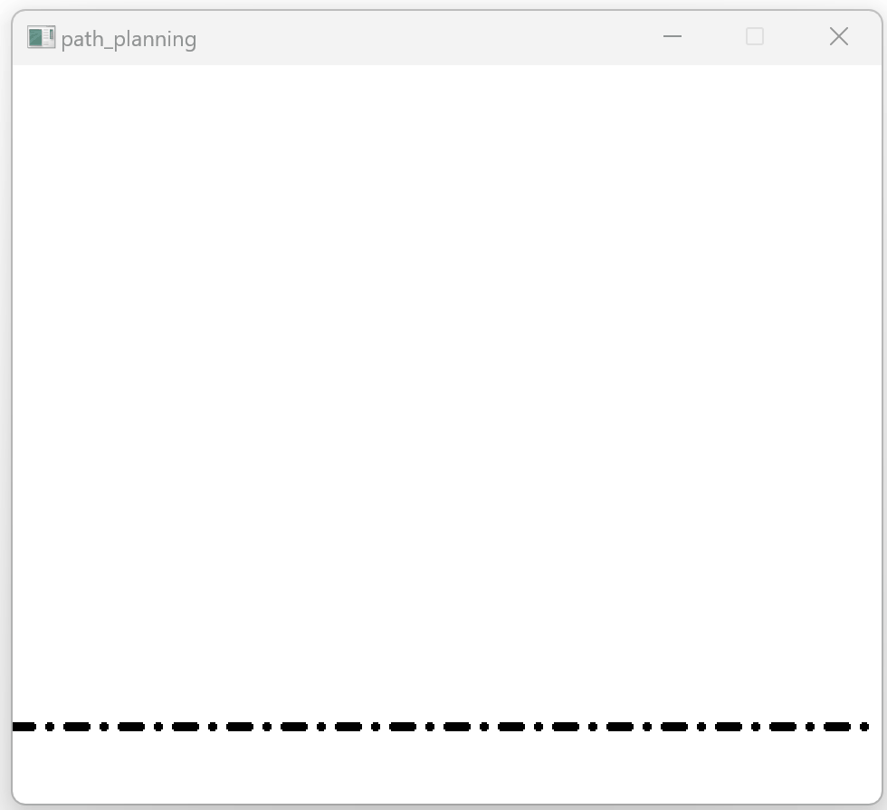
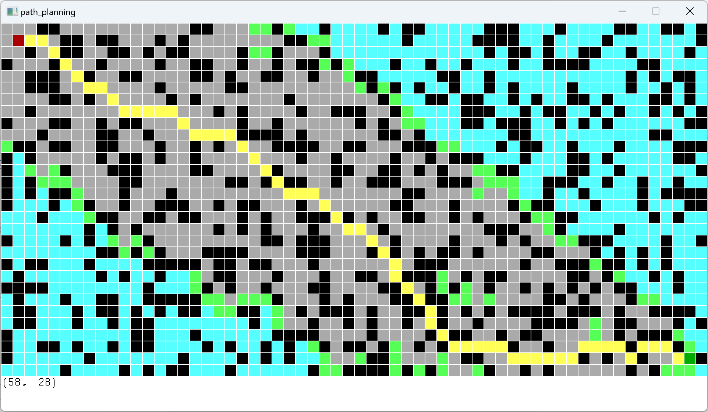

# How to use

The project aims to be a great template for new C++ programmers. It includes the implementation of common path planning algorithms in autonomous driving using C++.

## dependencies

The graphical user interface is implemented via the EasyX Graphics Library, which can be installed on this website: https://easyx.cn/.

## operation

Open visual studio 2019 and open path_planning.sln then you can enjoy it directly.

Use the right mouse button to draw obstacles when clicking in the interface and the left mouse button to start path planning when clicking in the interface.

# What's Included

This project contains the following path planning algorithms.

## run directly

- RRT

  

- A\*

  

## with bugs need to be fixed

- RRT\*
- Bezier Spline